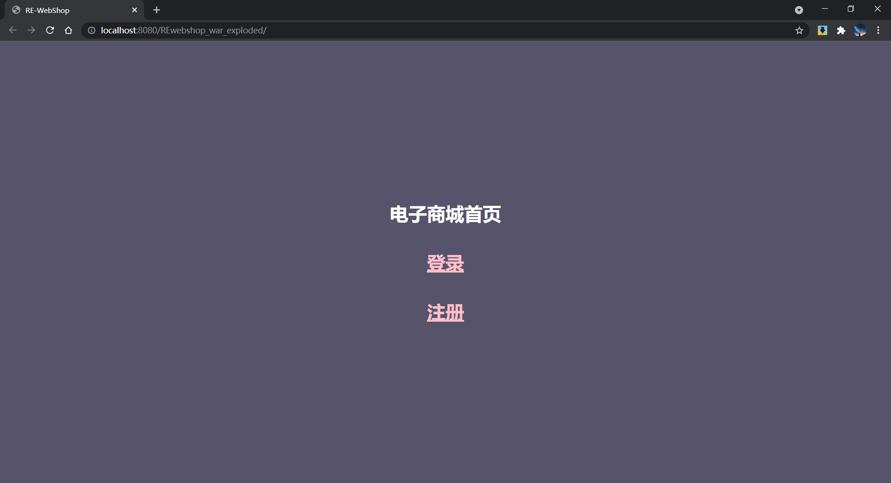
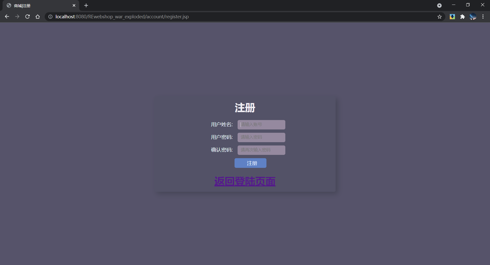
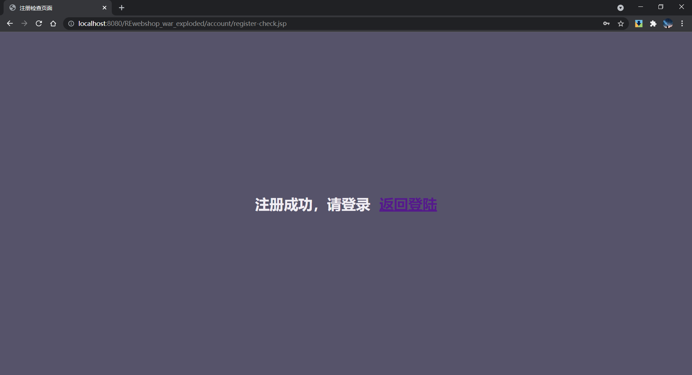
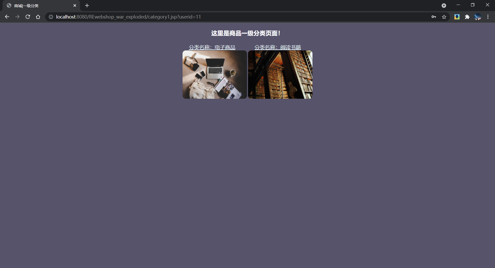
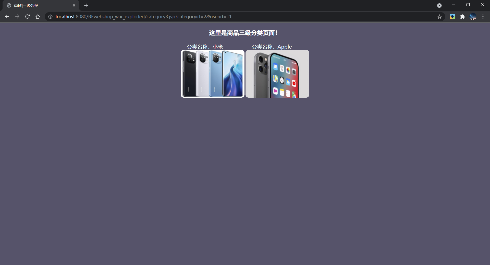
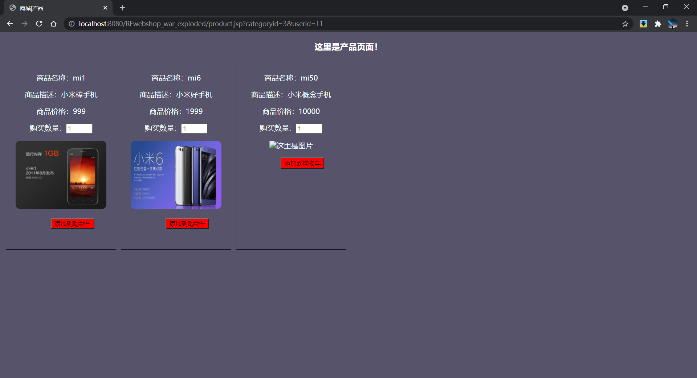
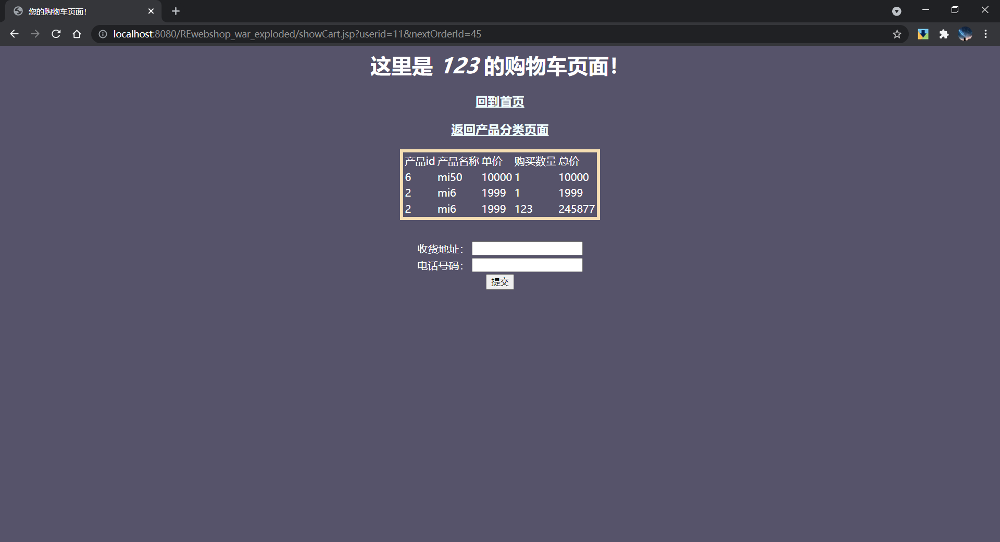
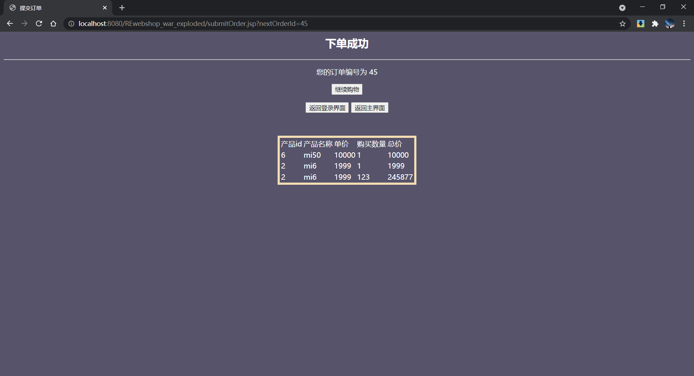
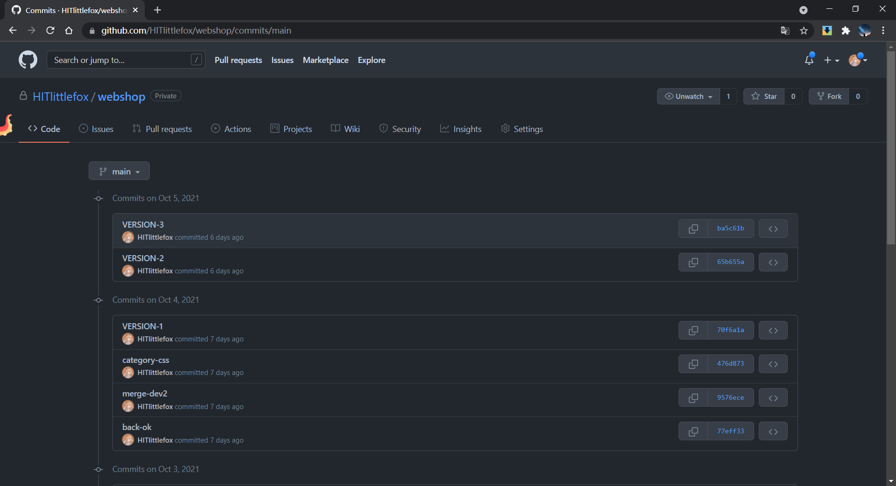

简述：

本webshop由***担任前端，***担任后端，独立完成。 时间线： 2021.09.30周四上午布置作业，下午完成数据库与流程建模。

Github地址：https://github.com/HITlittlefox/webshop

2021.09.30-2021.10.07，完成第一版webshop，大量使用框架内容与依赖。虽然动态较为自然，但是有些臃肿。 2021.10.07-2021.10.08，决定重新整理思路，简化webshop。
2021.10.08-2021.10.10，完成第二版webshop，实现登录、注册、加入购物车、下订单、查看订单详情等功能，且简化数据表中的逻辑，且统一前端风格，代码中也增添大量注释。
注：第二版webshop展示图片与第一版webshop展示图片都保存在webapp/glance文件夹中，可方便查看。

---

**精彩点：**

1. 采用外联样式表(**外联css**)。更方便、快捷、清晰的管理样式。
2. 小组成员采取GitHub建立私有仓库托管代码，**git**同步代码版本，大大提高了代码更新效率。
   
3. 采用**图床**。采用图片放到网络图库形成链接src的方式来展示图片，而非本地存放大量图片，节省了空间。
4. 拓展性强。在jsp中采取**循环**展示对一级分类、二级分类、三级分类、产品进行渲染展示，仅对相应数据表进行操作，填写相应信息即可，而不是一个产品，一堆代码。
5. 灵活采用**flag与主键、外键**，使得sql检索出的数据可以根据需求改变，比如“查看购物车”显示已放入购物车未下单；“订单详情”显示已放入购物车且已下单。大幅度简化了货物管理的代码量。避免了较复杂的json传值处理。
6. 对放入购物车的**数量**采用form提交。
7. 把连接数据库的java代码**封装**到ConnectionUtil.java，路径在src/main/java/com/example/rewebshop/util/ConnectionUtil.java
8. 把“放入购物车”的代码也**封装**成PutItCart，路径为src/main/java/com/example/rewebshop/PutItCart.java

---

该project的文件结构：
1. src/main/java/com/example/rewebshop/util/ConnectionUtil.java 内修改数据库连接的ip、端口、用户名、密码
2. 提交作业版本为第二版webshop展示图片的最新版本。
3. webapp中是**使用说明**，主页、一级目录分类页、二级目录分类页、三级目录分类页、产品页、显示购物车、下单并显示订单详情。
4. account中保存着账号相关，比如登录、登陆确认、注册、注册确认。
5. css中保存着各个页面的外联css。
6. glance保存着第一版webshop展示图片与第二版webshop展示图片

---

数据库结构：   

---

第二版webshop的**制作思路**：
(该图片保存在webapp文件夹内。)

1. 登录页面
    1. table
2. 注册页面
    1. table
    2. 确认密码需要和密码一致
3. 挑选货物页面，可放入购物车
    1. 需要知道是谁进入了该页面，从而知道插入购物车的时候带上谁的印记
    2. 需要循环展示货物(名称、描述、图片、价格、数量)
    3. 需要可以放入购物车 思路(不同页面用各自的父子关系传值连接！)：
       
4. 购物车页面，可下订单
5. 订单详情页面，此处采取了使用flag与订单号来确定单次订单内容。(详情见图片右侧)

---
